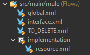
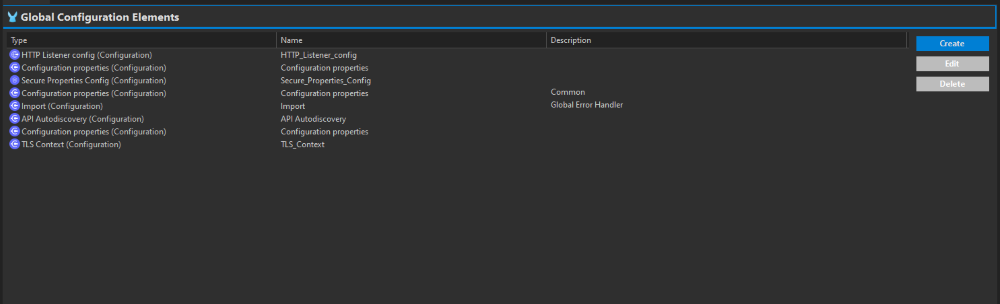
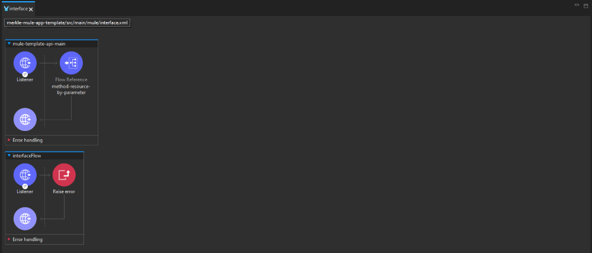
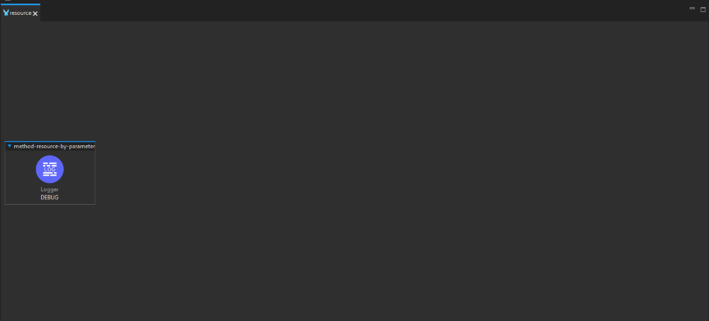
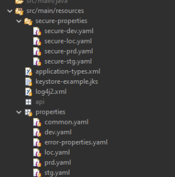
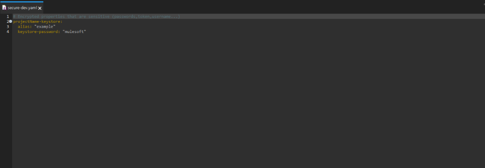
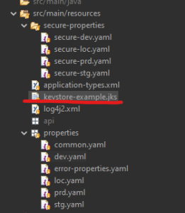
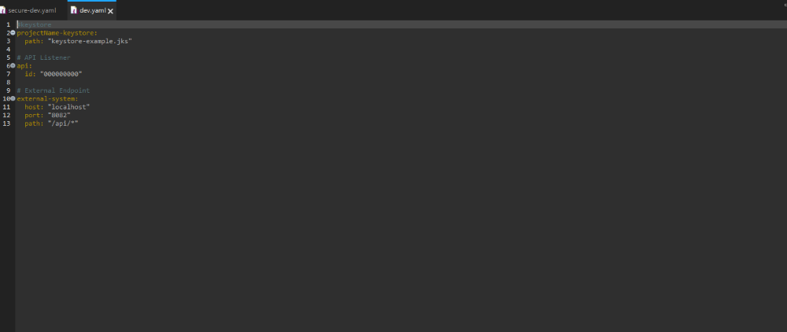
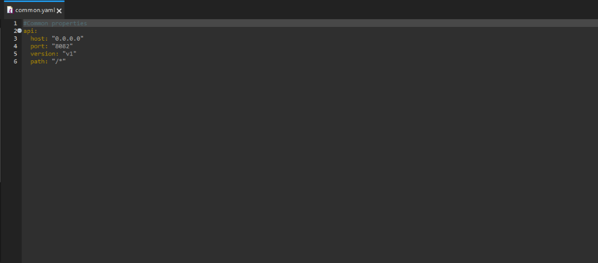
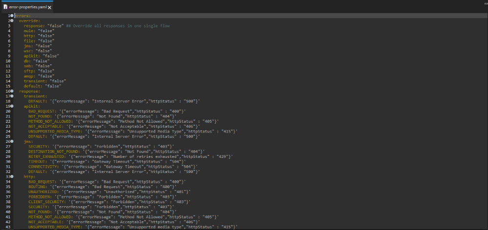

Summary
=======

This template assists developers in creating Mule applications more efficiently while maintaining consistent naming conventions and improving overall quality.

What is this?
=======

## Mule files

 - The global file keeps all the global elements of the applications (e.g. HTTP Connector)

 - The interface file keeps the code for the basic configuration settings for the API, such as the base path, version, and endpoint details.

 - TO_DELETE is file to keep global properties that are for local use only, (e.g. secure-key) and as the name indicates it to be  deleted before deployment to cloudhub

 - The Resource is where the logic of the API resided, like call to  other API's, choice flows..., this file should be named after the resource it manipulates (e.g. accounts) and a new should be created for each one

## Resource files

 - The Secure Properties folder holds the   secure properties files separated by environments

 - In the resource folder the re is a pre-made keystore (keystore-example.jks) it can be replaced with one that applies to your specific scenario

 - The Properties folder holds the properties files separated by environments, a file for common properties not depend on the environment and a error-properties file

